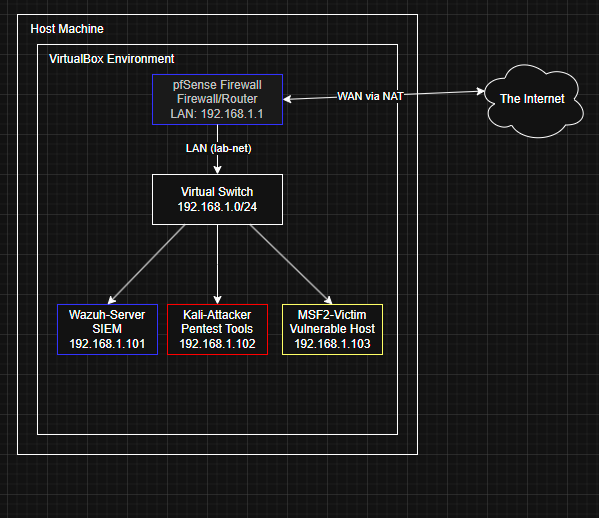
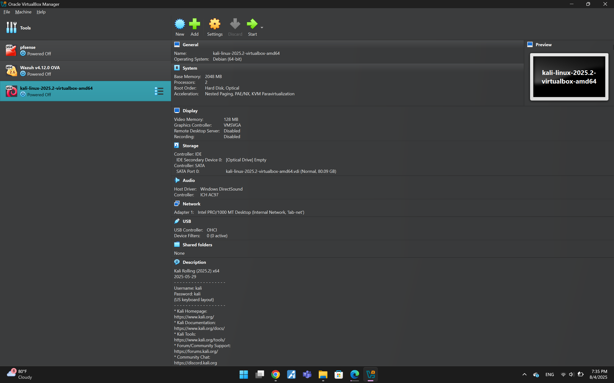
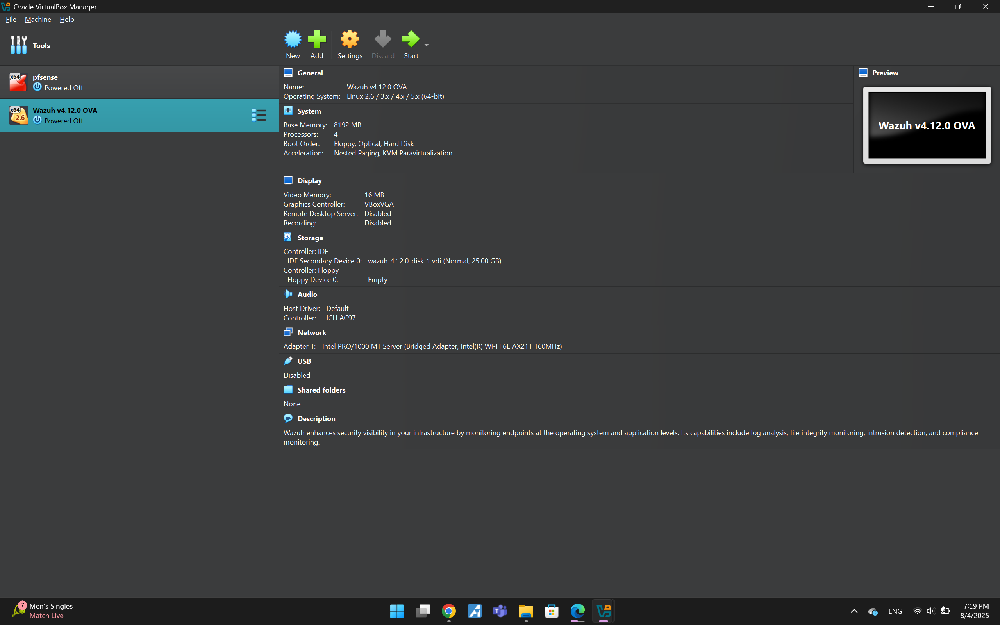
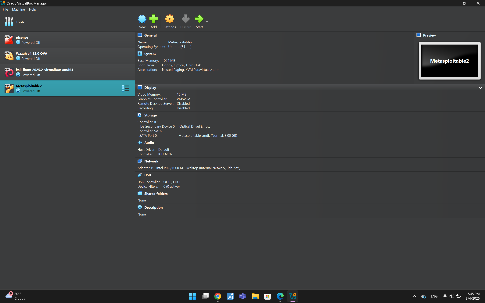
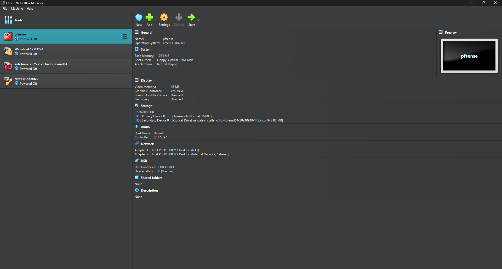

# Home Security Lab Journal - Lucas Busch

This journal documents the setup and configuration of a virtualized cybersecurity lab designed for defensive analysis and offensive security practice.

---

## Phase 1: Initial VM Provisioning and Network Configuration

### **Date: 8/4/2025**

**Objective:** To provision the core virtual machines within Oracle VirtualBox and establish the foundational private network topology.

### **1.0 - Network Topology Design and Architecture**

**Objective:** To visually map the logical and physical layout of the lab environment using a network topology diagram before provisioning any VMs. This diagram will serve as the architectural blueprint for the project.

**Description:** I used draw.io (diagrams.net) to create a comprehensive network diagram. The design uses a container-based model to clearly delineate the boundaries between the physical host, the virtualization layer, and the virtual network itself.

* **Host Container:** A main rectangle represents the physical host machine, illustrating the physical boundary of the entire lab.
* **VirtualBox Container:** Nested inside the host container, another rectangle defines the scope of the Oracle VirtualBox environment. All virtual components reside within this boundary.
* **Logical Flow:** The external "Cloud" icon, representing the internet, connects directly and exclusively to the pfSense VM's WAN interface. This connection crosses the container boundaries and is labeled as a NAT connection, accurately depicting how the lab accesses the outside world via the host's network connection.
* **Internal Network (lab-net):** All lab VMs (pfSense LAN, Wazuh, Kali, Metasploitable2) are connected to a virtual switch, representing the isolated lab-net. This ensures all internal traffic is segmented and can be monitored by the firewall.

---

### **1.1 - Provisioning the Attacker VM: Kali Linux**

**Description:**
The primary offensive machine for this lab is Kali Linux. I downloaded the pre-built VirtualBox image (`.7z` archive) from the official Kali website. This method was chosen for efficiency, as it bypasses the need for a full OS installation and includes VirtualBox Guest Additions for better integration. The VM was added to VirtualBox by registering its existing `.vbox` file.

**Network Configuration:** The VM's primary network adapter (Adapter 1) was configured to connect to the **Internal Network** named `lab-net`. This isolates the machine within our lab environment.

**Configuration Screenshot:**

---

### **1.2 - Provisioning the SIEM: Wazuh**

**Description:**
The core of the lab's defensive monitoring capabilities is the Wazuh Security Information and Event Management (SIEM) platform. I downloaded the official Open Virtual Appliance (`.ova`) file, which contains a fully configured Wazuh server, indexer, and dashboard. The VM was added using VirtualBox's "Import Appliance" feature.

**Network Configuration:** Post-import, the VM's network adapter was switched to the **Internal Network** named `lab-net`. This places the SIEM server on the same private network as the other lab components, allowing it to receive logs from agents.

**Configuration Screenshot:**

---

### **1.3 - Provisioning the Vulnerable Target: Metasploitable2**

**Description:**
To serve as a safe and intentionally vulnerable target for security testing, I provisioned the Metasploitable2 VM. This VM is distributed as a VMware machine, so a new VirtualBox machine was created to use the existing `Metasploitable.vmdk` virtual hard disk.

**Process:**
A new VirtualBox VM was created with a Linux/Ubuntu (64-bit) profile and 1024 MB of RAM. In the hard disk setup wizard, the existing `Metasploitable.vmdk` file was selected as the primary disk.

**Network Configuration:** The new VM's network adapter was then configured to use the **Internal Network** named `lab-net`.

**Configuration Screenshot:**

---

### **1.4 - Provisioning the Gateway/Firewall: pfSense**

**Description:**
The network gateway, router, and firewall for the entire lab is a pfSense VM. This will handle DHCP services for the internal lab network and manage all traffic flowing in and out. A new VM was created, and the pfSense `.iso` installer will be used for setup in the next phase.

**Network Configuration:**
This VM requires a dual-homed network configuration:
*   **Adapter 1 (WAN):** Configured as **NAT** to receive an internet connection from the host machine.
*   **Adapter 2 (LAN):** Configured as **Internal Network** with the name `lab-net` to connect to the internal lab.

**Configuration Screenshot:**
*(Note: The following image shows the dual-adapter setup for pfSense)*

---
**End of Phase 1.** The lab environment is now fully provisioned and networked. The next phase will be the sequential power-on and initial configuration of each component.

---

## Phase 2: System Initialization and Core Service Configuration

### **Date: 8/21/2025**

**Objective:** To perform the initial power-on and configuration of the core lab infrastructure, including the pfSense firewall, the Kali attacker VM, and the Wazuh SIEM. The goal is to establish a secure, baseline network with internet access and initial security monitoring capabilities.

### **2.1 - pfSense Firewall Installation and Configuration**

**Description:**
Following a video guide from ZacsTech, I initiated the installation of pfSense from the `.iso` media. The initial installation process was straightforward, however, I encountered a common virtualization pitfall: a boot loop. The system was repeatedly booting into the installer instead of the newly installed OS.

**Troubleshooting and Resolution:**
After reviewing the guide, I identified the cause: the virtual `.iso` media had not been ejected from the VM's virtual optical drive. After powering down the VM and removing the disk from the settings, pfSense booted correctly from its virtual hard disk.

**Configuration:**
1.  **Console Configuration:** Using the post-boot console menu, I assigned the network interfaces: the NAT adapter was set as **WAN**, and the `lab-net` adapter was set as **LAN**.
2.  **Web GUI Setup:** I then powered on the Kali Linux VM, which successfully received a DHCP lease from pfSense. Using Kali's Firefox browser, I navigated to the pfSense gateway (`https://192.168.1.1`) to complete the web-based setup wizard.
3.  **Hardening:** During the setup wizard, the default `admin` password was changed to a strong, unique password.

**Validation:**
Internet connectivity for the entire lab network was successfully established. This was verified by using the pfSense diagnostics tool to ping an external host (`google.com`), which returned successful replies.

---

### **2.2 - Kali Linux Initial Hardening**

**Description:**
As a primary security measure, the default credentials for the Kali Linux VM were changed.

**Process:**
After logging in with the default `kali`/`kali` credentials, I used the `passwd` command in the terminal to set a new, strong password for the `kali` user account. This mitigates the risk of trivial unauthorized access.

---

### **2.3 - Wazuh Server Activation and Agent Deployment**

**Description:**
With the network operational, the Wazuh SIEM server was powered on. It correctly acquired an IP address from the pfSense DHCP server.

**Process:**
1.  **Accessing the Dashboard:** From the Kali VM's browser, I navigated to the Wazuh server's assigned IP address and logged into the web dashboard using the default credentials.
2.  **First Agent Deployment:** I initiated the "Deploy a new agent" process. Following the prompts, I selected the correct package type for Kali Linux (**DEB amd64**) and configured the agent to report back to the Wazuh server's IP.
3.  **Installation:** The generated installation command was copied and executed with `sudo` privileges in the Kali terminal.

**Validation:**
The agent installation was successful. The Kali VM appeared in the Wazuh dashboard with an "Active" status, confirming that the agent is successfully communicating with the server and forwarding security data.

---

### **2.4 - Lab State Snapshot and Next Steps**

**Description:**
The core infrastructure of the lab is now configured, hardened, and operational. A stable baseline has been achieved. To preserve this functional state, I have taken a snapshot of the pfSense, Kali, and Wazuh VMs. The Metasploitable2 VM remains in its original, powered-off state, ready for the next phase.

**Next Objective:**
The immediate next step is to power on the Metasploitable2 VM and deploy a Wazuh agent on it. This will complete the instrumentation of the lab, allowing for offensive exercises to be launched from Kali and detected by Wazuh.
