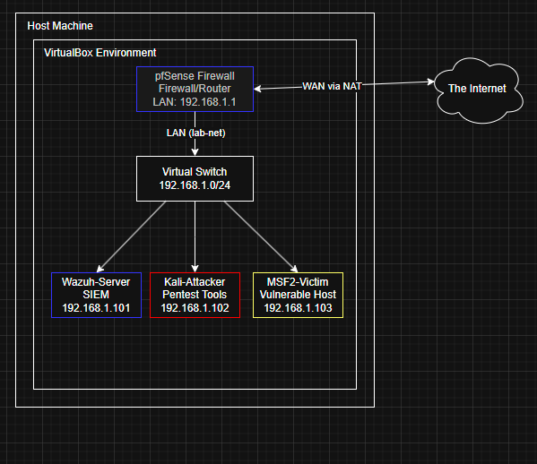

# Home-SOC-Lab
Fully virtualized cybersecurity home lab for threat detection and analysis using Wazuh, pfSense, and Kali Linux

## Table of Contents
* [Overview](#overview)
* [Lab Components](#lab-components)
* [Key Skills Demonstrated](#key-skills-demonstrated)
* [Project Objectives](#project-objectives)
* [Configuration Details](#configuration-details)
* [Attack & Detection Scenarios](#attack--detection-scenarios)
* [Lab Journal](#lab-journal)
* [Future Improvements](#future-improvements)

---

### Overview

This project is a fully functional, virtualized Security Operations Center (SOC) built on a single host machine. The primary goal is to simulate common cyber attacks within a controlled environment and use open-source security tools to detect, analyze, and alert on that malicious activity. This serves as a practical application of the concepts learned through my CompTIA Security+ studies and my Computer Science curriculum at the University of Michigan.

---

### Lab Components

| Role              | Tool/OS             | Purpose                                                                 |
|-------------------|---------------------|-------------------------------------------------------------------------|
| **Hypervisor**    | Oracle VirtualBox   | Manages and runs all virtual machines on the host.                      |
| **Firewall/Router** | pfSense             | Segments the lab network, controls traffic, and serves as a log source. |
| **SIEM/XDR**      | Wazuh               | Ingests logs, analyzes events, and generates security alerts.           |
| **Attacker VM**   | Kali Linux          | Launches simulated attacks (e.g., port scans, vulnerability exploits).  |
| **Victim VM**     | Metasploitable2     | An intentionally vulnerable Linux server to act as the target.          |

---

### Key Skills Demonstrated

*   **Network Architecture & Administration:** Deployed and configured a pfSense firewall to create network segments and routing rules.
*   **Security Information and Event Management (SIEM):** Installed and configured a Wazuh SIEM, deployed agents, and ingested logs from multiple sources.
*   **Threat Detection:** Wrote and tuned detection rules in Wazuh to identify specific malicious activities.
*   **Log Analysis:** Analyzed raw logs from network devices and endpoints to investigate security alerts.
*   **Offensive Security Methodologies:** Utilized Kali Linux tools (Nmap, Metasploit) to perform reconnaissance and exploitation.
*   **Virtualization:** Created and managed a multi-VM environment using VirtualBox.

---

### Project Objectives

My objective was to create a closed-loop scenario: **Launch an attack and see the corresponding alert.** This demonstrates a full understanding of the attack lifecycle from a defensive perspective.

1.  Build a stable, segmented virtual network.
2.  Aggregate logs from all devices into a central SIEM.
3.  Execute a controlled attack from the Kali VM against the Victim VM.
4.  Successfully detect and analyze the attack in the Wazuh dashboard.
5.  Document the entire process.

---

### Configuration Details

**Network Topology**
The lab operates within a private network (lab-net, 192.168.1.0/24) managed by a pfSense firewall. All virtual machines are hosted within a VirtualBox environment on a single physical host. The firewall is the sole gateway to the internet via a NAT connection, ensuring all traffic is monitored and controlled.

---

### Attack Detection Scenarios

(This section will be filled out once I perform attacks)

---

### Lab Journal

For a detailed, step-by-step log of the entire lab build process including specific commands and configuration screenshots please see the full lab journal.

[View the Full Lab Journal](LAB_JOURNAL.md)

---

### Future Improvements

| System                                        | Purpose                                                                                                                                                                                                     | 
| --------------------------------------------- | -------------------------------------------------------------------------------------------------------------------------------------------------------------------------------------------------------- |
| **Upgrading Victim Environment** | Swapping Metasploitable2 for a Windows 10 Enterprise Evaluation VM to practice detecting threats more relevant to modern corporate environments, such as malicious PowerShell commands or suspicious scheduled tasks. |
| **Adding Network Intrusion Detection (NIDS)** | Integrating Suricata on the pfSense firewall to add signature-based threat detection at the network level, providing another layer of visibility. |
| **Enhancing Log Sources** | Setting up a web server (e.g., Apache) on a new victim VM and configuring Wazuh to ingest and analyze its access and error logs to detect web-based attacks like SQL injection or directory traversal. |

---
